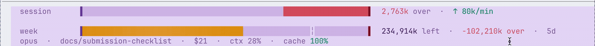

# maxx

**You're deep in an agent session. Flowing. Building. Then — *bam* — "you've hit your limit." Everything stops. You never saw it coming.**

maxx is the fuel gauge that keeps Claude Code users from getting blindsided. It shows the limits the agent actually reports, when they reset, how much local context you are carrying, and where your tokens went.

maxx has an animated two-rail status line:


*…and when you're burning too fast, it goes red before you run out:*


*The session rail shows your live standing — red grows in from the right when you're over your sustainable pace, green from the left when you're banking — the numbers roll one digit at a time, and a trailing ↑/↓ rate tells you if you're catching up or falling behind:*



## Setup

One line in your terminal. Installs the bar **and** the `/maxx` skill, wires the statusline, backs up your `settings.json` first:

```bash
curl -fsSL https://raw.githubusercontent.com/goodindustries/Maxx/main/tokenmaxx/install.sh | bash
```

Restart Claude Code — done. (Needs Node and git on your `PATH`.)

<details>
<summary>Rather clone than pipe curl into bash?</summary>

```bash
git clone https://github.com/goodindustries/Maxx.git && Maxx/tokenmaxx/install.sh
```
</details>

<details>
<summary>Just want the <code>/maxx</code> skill (no status bar) via the plugin manager?</summary>

In Claude Code:

```text
/plugin marketplace add goodindustries/Maxx
/plugin install maxx@maxx
```
</details>

Type `/maxx` any time:

- `/maxx` — total tokens, tokens/day, cache-hit rate, and streak
- `/maxx session` — session tokens: how much to burn this rolling 5h window

## How to read it

Two rails, always on. Both anchored to the exact `five_hour` / `seven_day` percentages `/usage` reports.

**`session` — your rolling 5-hour standing.** One directional fill:

- **green from the left** — banked: under your sustainable pace, building a cushion.
- **red from the right** — over: burning faster than sustainable; longer red = deeper hole.
- The number beside it (`Xk over` / `Xk tokens`) rolls one digit at a time, and a trailing **↑ / ↓ k/min** tells you whether you're recovering or falling behind *right now*.

**`week` — your weekly reserve.** A fuel tank: the fill is budget **remaining**, draining as you spend (green → amber → red as it runs low). The `┊` tick marks even-burn pace — past it you're ahead, short of it you're hot. Then `Xk left`, your pace standing (`banked` / `over`), and days to reset.

**Context** — the meta line shows how full the model context is (separate from the account rate limit), plus model, branch, spend, and cache-hit rate.

## Your stuff stays yours

maxx has no analytics service and sends no data to maxx or another third party. Claude Code parsing stays entirely on your computer.

## How it works

Claude enforces two hard walls at once: a five-hour session cap and a seven-day weekly cap. Maxing the raw 5h cap every window drains the week days before it refreshes — then you're locked out. So maxx paces you to a **session token budget** = weekly tokens-left ÷ the 5h windows left this week, over a rolling 5h window, bounded by the 5h wall. It's a tank: burning drains it, and it recovers as old usage ages out (bank by chilling). Go light and it climbs (frugal now = more later); overspend and it shrinks. That's what `maxx session` reports.

Everything is anchored to Anthropic's authoritative `five_hour` / `seven_day` percentages — the same numbers `/usage` shows. Those are the only ground truth Claude exposes; the token magnitudes are estimates derived from them, so steer by the percentage and the pace.

Fast live query:

```bash
node ~/.claude/skills/maxx/render.mjs --session   # "how much to spend this session"
node ~/.claude/skills/maxx/render.mjs --status    # machine-readable status.json
```

Data flow:

- `render.mjs` receives live rate-limit percentages and reset times, writes `~/.tokenmaxx/rl.json` + `~/.tokenmaxx/status.json`, and draws the bar.
- `limit.mjs` maintains rolling token buckets in `~/.tokenmaxx/window.json` (incremental transcript tails + periodic reconciliation), and emits the session governor gate (`sessionSafe` / `sessionToSpend` / `sessionOver`) so an unattended agent can burn only its sustainable per-window share.
- `nazi.mjs` is an hourly posture check an agent runs on itself — usage history, context/cache, CLAUDE.md tax → ranked token drains + one lever.

## Development

Requires Node 18 or newer. There is currently no automated test suite for the Claude Code plugin.

## License

MIT — free to use. See [LICENSE](LICENSE).
