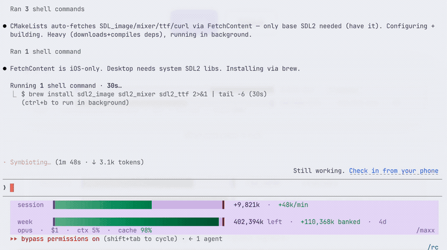
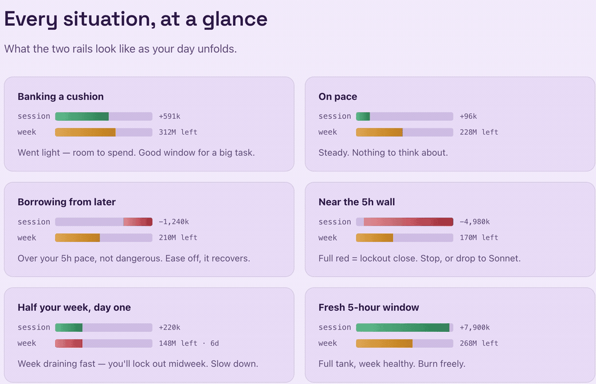
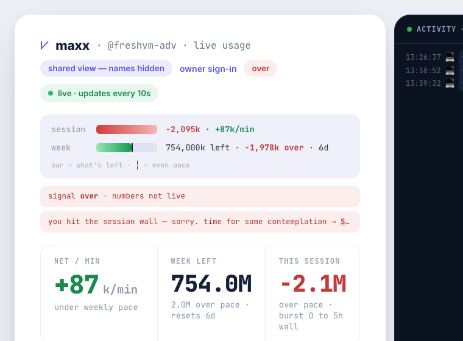
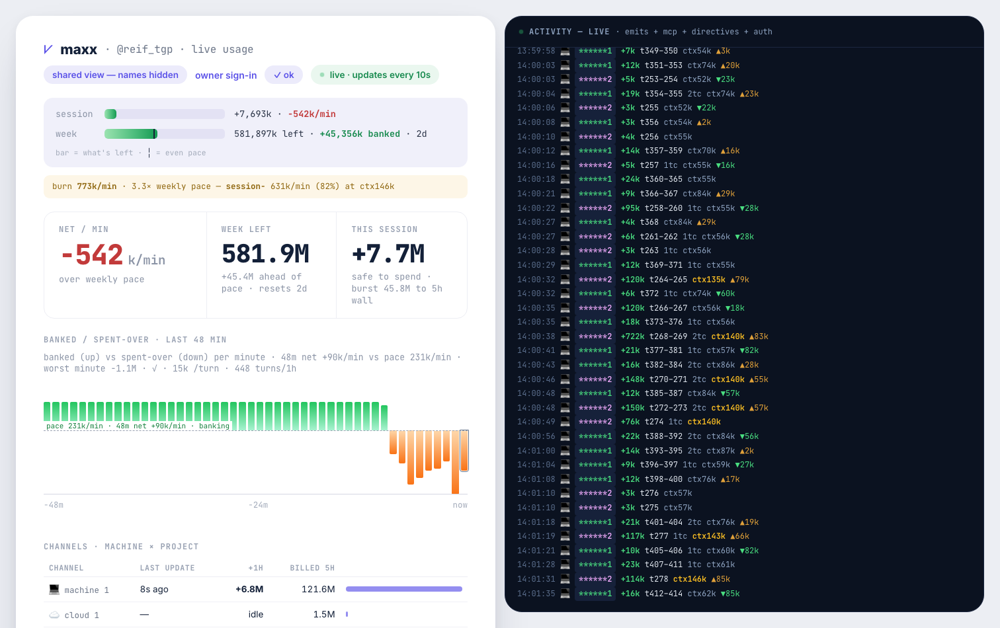
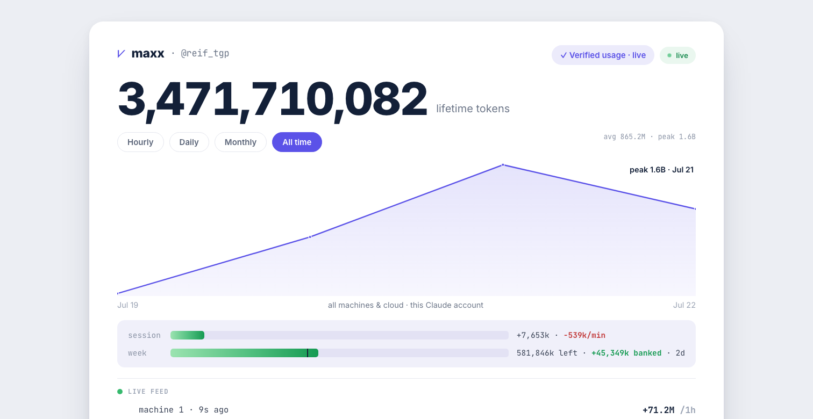
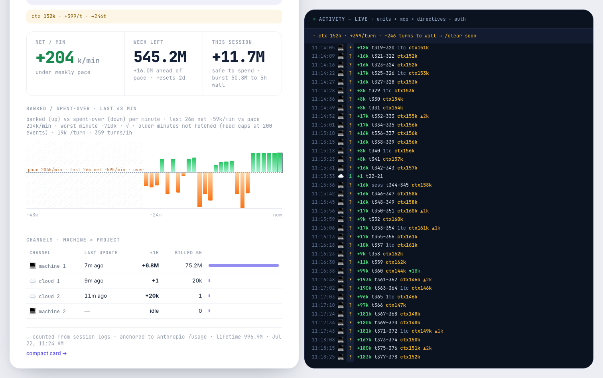
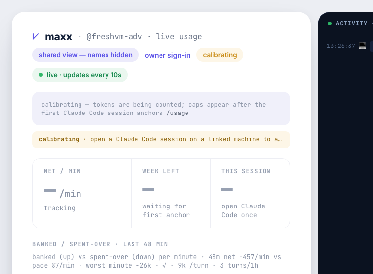
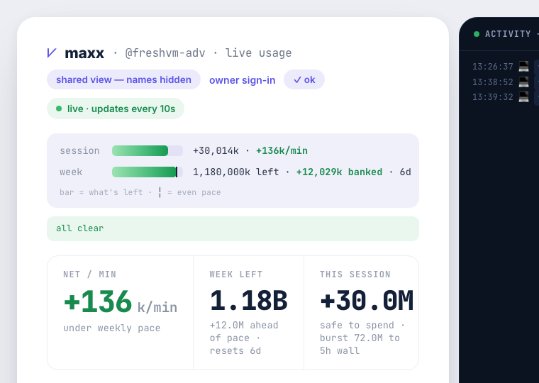

# maxx

### Track your tokens from everywhere.

🌐 [meetmaxx.co](https://meetmaxx.co) · [Install](#install) · [How to read the bar](#how-to-read-the-bar)

Every machine, every cloud agent, one live tally — in your terminal and on one page.

Claude enforces two walls at once: a 5-hour session cap and a 7-day weekly cap. `/usage` shows you the 5-hour one, which is not the one that ends your week. A 7-day limit holds about 2.8 days of full 5-hour sessions, so spending every window to the wall puts you out of tokens by Wednesday.

maxx counts what you actually spend, prices it per model, and shows both walls at once.



## Install

One line. Installs the bar and the `/maxx` skill, wires the statusline, backs up your `settings.json` first:

```bash
curl -fsSL https://meetmaxx.co/install | bash
```

Restart Claude Code. Done. (Needs Node and git on your `PATH`.)

<details>
<summary>Rather clone than pipe curl into bash?</summary>

```bash
git clone https://github.com/goodindustries/Maxx.git && Maxx/maxx/install.sh
```
</details>

<details>
<summary>Just want the <code>/maxx</code> skill (no status bar) via the plugin manager?</summary>

In Claude Code:

```text
/plugin marketplace add goodindustries/Maxx
/plugin install maxx@maxx
```
</details>

Then type `/maxx` any time:

- `/maxx` — total tokens, tokens/day, cache-hit rate, streak
- `/maxx session` — how much you can safely spend now (weekly-paced, capped at the 5h wall) plus the hard burst ceiling

Renders through the Claude Code statusline in plain ANSI, so it works wherever Claude Code does. Verified on macOS Terminal.app (auto 256-color), iTerm2, Ghostty; truecolor everywhere else — Warp, Alacritty, kitty, the VS Code and Cursor terminals, tmux, ssh, Linux.

## How to read the bar



Two rails, both anchored to the exact `five_hour` / `seven_day` percentages `/usage` reports.

**`session`** — what you can safely spend now: your weekly budget paced across the 5-hour windows left. Green from the left is banked, red from the right is over. The signed number (`+Xk` banked / `−Xk` over) carries a trailing `±k/min` telling you whether you are recovering or falling behind right now.

**`week`** — tokens left in your 7-day limit, updated every second. The fill is what remains; the `┊` tick marks even-burn pace. Fill past the tick and you are banked, short of it and you are spending too fast.

**meta** — context fill, model, branch, spend, cache-hit rate, and `137k/+43k turn`: what your last 3 turns cost on average, and how far the newest turn sits from that average. That delta moves first when a context starts re-billing itself, well before the 5h meter reacts. The `@you` sign-off is a link to your dash (OSC 8 — cmd-click it in iTerm2, Ghostty, kitty).

**the wall** — hit the 5-hour wall and the bar says so and hands you [Switzerland in 8K](https://www.youtube.com/watch?v=linlz7-Pnvw) with the reset clock. Claude stopped you anyway; the dash shows the same row. Time for some contemplation.



## The math

Every number on the bar comes from four lines. Check them against `/usage` any time.

```text
pace    to_spend = week_left ÷ 5h_windows_left     The sustainable spend for this next 5hr period.
anchor  cap = burned ÷ used%                       Pinned to Claude's own /usage numbers every refresh.
burn    (input + 5·output + 1.25·cache_write
         + 0.1·cache_read) × model_price           Different models cost different.
models  haiku ⅓ · sonnet 1 · opus 5⁄3 · fable 10⁄3  Price-weighted, refreshed daily from Anthropic's price sheet.
```

A Fable token costs ten times a Haiku token. Unweighted, a Haiku subagent token would count the same as a Fable token; weighted, the pacing is honest.

## Everywhere

Your quota is one pool, so maxx counts it as one. Claim a handle and every surface reports to the same tally:

```bash
node ~/.claude/skills/maxx/emit.mjs --signup
```

The dash — every machine and cloud agent, live, with the activity tail ([this one is real](https://meetmaxx.co/u/reif/dash), public view, names redacted):



The card — the lifetime odometer ([live](https://meetmaxx.co/u/reif)):



Every feed row says where it came from — 💻 machine, ☁️ cloud:



- **Laptops** — `emit.mjs --watch` ships counts continuously (launchd agent on macOS).
- **Cloud routines and claude.ai** — add the printed URL as a custom MCP connector. Any agent holding it gets the budget-gate rules on connect and can call `maxx_budget` / `maxx_emit` against your account only.
- **Your dashboard** — `meetmaxx.co/u/<you>` is a live card; `/u/<you>/dash` is the dash: burn rate, per-session attribution, channels (💻 machines, ☁️ cloud), and what each is costing per turn. The dash is the page you share — viewers see it live with names redacted (`machine 1`, `******2`); only your secret shows the real names.
- **Your own tooling** — `GET /api/u/<you>/budget` serves live availability and top burners; webhooks push `over` / `recovered` / `week-80` / `week-90` / `week-95` / `runaway` transitions.

### The gate and the watchdog

`gate.mjs` installs as a PreToolUse hook and denies expensive spawns when the tally says you are out. Verdicts are `ok`, `degraded` (no machine has read `/usage` lately, so the weekly ledger governs), `over`, `stale`, and `calibrating` (a brand-new account before its first Claude Code session anchors the caps — pages render it neutral, agents treat it as a stop).

| fresh account: calibrating | first session anchors it: live |
|---|---|
|  |  |

The watchdog runs server-side on every emit. When the account is burning several times its sustainable pace and one session is driving it — because its context grew large enough that every turn re-bills the whole thing — it queues a `clear` directive against that session, which `gate.mjs` injects as context on that session's next tool call. Advisory only: it never pauses or denies, and it will not nag the same session twice in half an hour.

## Your stuff stays yours

Local by default: nothing leaves your machine until you claim a handle. After that, maxx sends counts only — tokens, timestamps, model names. Never a prompt, never a message, never your code. The emitter cannot leak content because it never reads it.

Without a handle the only network call is a daily read-only fetch of Anthropic's public price sheet ([prices.mjs](maxx/prices.mjs)), which sends nothing.

## How it works

Maxing the raw 5h cap every window drains the week days before it refreshes, and then you are locked out. So maxx paces you to a **session token budget** = weekly tokens left ÷ 5h windows left this week, over a rolling 5h window, bounded by the 5h wall. It behaves like a tank: burning drains it, and it recovers as old usage ages out.

Everything is anchored to Anthropic's authoritative `five_hour` / `seven_day` percentages — the only ground truth Claude exposes. Token magnitudes are estimates derived from them, so steer by the percentage and the pace.

```bash
node ~/.claude/skills/maxx/render.mjs --session   # "how much to spend this session"
node ~/.claude/skills/maxx/render.mjs --status    # machine-readable status.json
```

- `render.mjs` receives live rate-limit percentages and reset times, writes `~/.maxx/rl.json` + `~/.maxx/status.json`, and draws the bar.
- `limit.mjs` maintains rolling price-weighted token buckets in `~/.maxx/window.json` (incremental transcript tails plus periodic reconciliation) and emits the session governor so an unattended agent burns only its sustainable share.
- `emit.mjs` ships per-session counts to the central tally and attaches the `/usage` anchor.
- `prices.mjs` refreshes per-model quota weights daily; `limit.mjs` falls back to built-in weights without it.
- `server/` is the tally itself: `tally.mjs` is pure (ingest, budget, directives, watchdog), `handler.mjs` wraps it in HTTP + MCP and renders the card and dash.

## Development

Requires Node 18 or newer.

```bash
npm test    # node --test maxx/*.test.mjs server/*.test.mjs
```

## License

MIT. Free to use. See [LICENSE](LICENSE).
