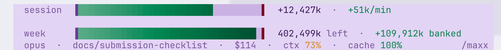

# maxx

### 🌐 [meetmaxx.co](https://meetmaxx.co) · [Install](#install) · [How to read it](#how-to-read-the-token-fuel-gauge)

**How many times have you hit your weekly limit before your project was done?**

`/usage` is built by the guys trying to sell you tokens. You get about 2.8 days of full 5hr sessions in a 7 day window. Keep maxing them and you're out of tokens by Wednesday.

maxx is the token fuel gauge for Claude Code. Tokenmaxx is spelled with maxx.

It lives in your status line. Two rails, updating as you work:


Up close: signed standing (`+banked` / `−over`), gradient fills, numbers that roll one digit at a time:



## Install

One line in your terminal. Installs the bar and the `/maxx` skill, wires the statusline, backs up your `settings.json` first:

```bash
curl -fsSL https://meetmaxx.co/install | bash
```

Restart Claude Code. Done. (Needs Node and git on your `PATH`.)

<details>
<summary>Rather clone than pipe curl into bash?</summary>

```bash
git clone https://github.com/goodindustries/Maxx.git && Maxx/maxx/install.sh
```
</details>

<details>
<summary>Just want the <code>/maxx</code> skill (no status bar) via the plugin manager?</summary>

In Claude Code:

```text
/plugin marketplace add goodindustries/Maxx
/plugin install maxx@maxx
```
</details>

Then type `/maxx` any time:

- `/maxx`: total tokens, tokens/day, cache-hit rate, and streak
- `/maxx session`: how much you can safely spend now (weekly-paced, capped at the 5h wall) + the hard burst ceiling

## You've been flying blind. Here's the math.

Every number on the bar comes from four lines. Check them against `/usage` any time.

```text
pace    to_spend = week_left ÷ 5h_windows_left     The sustainable spend for this next 5hr period.
anchor  cap = burned ÷ used%                       Pinned to Claude's own /usage numbers every refresh.
burn    (input + 5·output + 1.25·cache_write
         + 0.1·cache_read) × model_price           Different models cost different.
models  haiku ⅓ · sonnet 1 · opus 5⁄3 · fable 10⁄3  Price-weighted. Refreshed daily from Anthropic's price sheet.
```

Fable > Opus > Sonnet > Haiku, so your token usage is pinned to market prices. Unweighted, a Haiku subagent token counts the same as a Fable token. Weighted, the pacing is honest.

## How to read the token fuel gauge

Session rail and weekly rail. Both anchored to the exact `five_hour` / `seven_day` percentages `/usage` reports.

**`session`**: use less before, have more now, rolling the last 5 hours.

- **Green from the left**: banked. Under your sustainable pace, building a cushion.
- **Red from the right**: over. Burning faster than sustainable; longer red = deeper hole.
- The signed number (`+Xk` banked / `−Xk` over) rolls one digit at a time, with a trailing **±k/min** telling you whether you're recovering or falling behind right now. Full red means the 5h wall is close.

**`week`**: total remaining tokens estimated available. A fuel tank: the fill is budget remaining, draining as you spend (green to amber to red). The `┊` tick marks even-burn pace. Then `Xk left`, your pace standing, and days to reset.

**Context**: a meta line with context fill, model, branch, spend, and cache-hit rate.

## Examples

What the two rails look like as your day unfolds ([animated at meetmaxx.co](https://meetmaxx.co#situations)):


| Situation | `session` | `week` | What it means |
|---|---|---|---|
| **Tokens available** | `+591k` 🟢 | `312M left` | Good pacing, but it's time to get back to working. |
| **On pace** | `+96k` 🟢 | `228M left` | Steady. Nothing to worry about, except everything else. |
| **Borrowing from later** | `−1,240k` 🔴 | `210M left` | Running a bit hot, that feature better be worth it. |
| **Near the 5h wall** | `−4,980k` 🔴 | `170M left` | Drop it like it's hot, or Claude will drop you. |
| **Half your week, day one** | `+220k` 🟢 | `148M left · 6d` 🔴 | Week draining fast. Plan better, or go for a walk or something. |
| **Fresh 5-hour window** | `+7,900k` 🟢 | `268M left` | Full tank, week healthy. Free to fly! |

## Works in every terminal. (Except for that one we don't have support for).

maxx renders through the Claude Code statusline. Plain ANSI. And a pain in the ANSI to build.

Verified on macOS: Terminal.app (auto 256-color mode), iTerm2, Ghostty. Truecolor everywhere else: Warp, Alacritty, kitty, the VS Code and Cursor terminals, tmux, ssh, Linux.

## Your stuff stays yours

No analytics, no phone-home. Your usage is parsed on your machine. The only network call is a daily read-only fetch of Anthropic's public price sheet ([prices.mjs](maxx/prices.mjs)). It sends nothing. No data leaves the box.

## How it works

Claude enforces two hard walls at once: a five-hour session cap and a seven-day weekly cap. Maxing the raw 5h cap every window drains the week days before it refreshes. Then you're locked out. So maxx paces you to a **session token budget** = weekly tokens left ÷ the 5h windows left this week, over a rolling 5h window, bounded by the 5h wall. It's a tank: burning drains it, and it recovers as old usage ages out. Go light and it climbs. Overspend and it shrinks. That's what `/maxx session` reports.

Everything is anchored to Anthropic's authoritative `five_hour` / `seven_day` percentages, the same numbers `/usage` shows. Those are the only ground truth Claude exposes; token magnitudes are estimates derived from them, so steer by the percentage and the pace.

Fast live query:

```bash
node ~/.claude/skills/maxx/render.mjs --session   # "how much to spend this session"
node ~/.claude/skills/maxx/render.mjs --status    # machine-readable status.json
```

Data flow:

- `render.mjs` receives live rate-limit percentages and reset times, writes `~/.maxx/rl.json` + `~/.maxx/status.json`, and draws the bar.
- `limit.mjs` maintains rolling price-weighted token buckets in `~/.maxx/window.json` (incremental transcript tails + periodic reconciliation), and emits the session governor gate (`sessionSafe` / `sessionToSpend` / `sessionOver`) so an unattended agent burns only its sustainable per-window share. `limit.mjs --nazi` is an hourly posture check: ranked token drains plus one lever.
- `prices.mjs` refreshes per-model quota weights daily from Anthropic's public price sheet into `~/.maxx/prices.json`; `limit.mjs` falls back to built-in weights without it.

## Development

Requires Node 18 or newer. Tests: `node --test maxx/maxx.test.mjs`.

## License

MIT. Free to use. See [LICENSE](LICENSE).
