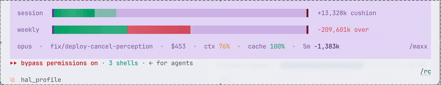
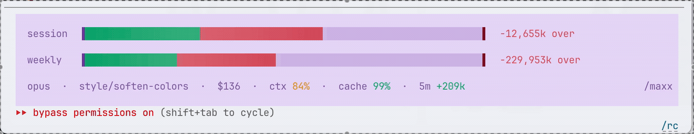

# maxx

**You're deep in an agent session. Flowing. Building. Then — *bam* — "you've hit your limit." Everything stops. You never saw it coming.**

maxx is the fuel gauge that keeps Claude Code users from getting blindsided. It shows the limits the agent actually reports, when they reset, how much local context you are carrying, and where your tokens went.

maxx has an animated two-rail status line:



*…and when you're burning too fast, it goes red before you run out:*



## Setup

In Claude Code:

```text
/plugin marketplace add goodindustries/Maxx
/plugin install maxx@maxx
```

Then turn on the custom bar from your terminal:

```bash
git clone https://github.com/goodindustries/Maxx.git && Maxx/tokenmaxx/install.sh
```

Restart Claude Code. The bar needs Node on your `PATH`.

Type `/maxx` any time:

- `/maxx` — total tokens, tokens/day, cache-hit rate, and streak
- `/maxx session` — session fuel: how much to burn this rolling 5h window

## How to read it

The persistent gauges show the usage windows reported by your agent.

- **Green** — you have runway.
- **Red** — your current pace is heading toward the wall before reset.
- **Reset** — when that window becomes available again.
- **Context** — how full the current model context is; this is separate from the account rate limit.

The custom rails show your signed token cushion/overage and visibly recover as usage ages out. The weekly rail carries a live drain speedometer (`↓X/min`) so the number reads as motion, not a frozen odometer.

## Your stuff stays yours

maxx has no analytics service and sends no data to maxx or another third party. Claude Code parsing stays entirely on your computer.

## How it works

Claude enforces two hard walls at once: a five-hour session cap and a seven-day weekly cap. Maxing the raw 5h cap every window drains the week days before it refreshes — then you're locked out. So maxx paces you to a **roll-session** budget = weekly tokens-left ÷ the 5h windows left this week, bounded by the 5h wall. It banks: go light and the number climbs (frugal now = more later); overspend and it shrinks. That's what `maxx session` reports as "to spend".

Everything is anchored to Anthropic's authoritative `five_hour` / `seven_day` percentages — the same numbers `/usage` shows. Those are the only ground truth Claude exposes; the token magnitudes are estimates derived from them, so steer by the percentage and the pace.

Fast live query:

```bash
node ~/.claude/skills/maxx/render.mjs --session   # "how much to spend this session"
node ~/.claude/skills/maxx/render.mjs --status    # machine-readable status.json
```

Data flow:

- `render.mjs` receives live rate-limit percentages and reset times, writes `~/.tokenmaxx/rl.json` + `~/.tokenmaxx/status.json`, and draws the bar.
- `limit.mjs` maintains rolling token buckets in `~/.tokenmaxx/window.json` (incremental transcript tails + periodic reconciliation), and emits the roll-session governor gate (`sessionSafe` / `sessionToSpend` / `sessionOver`) so an unattended agent can spend only its sustainable per-window share.
- `nazi.mjs` is an hourly posture check an agent runs on itself — usage history, context/cache, CLAUDE.md tax → ranked token drains + one lever.

## Development

Requires Node 18 or newer. There is currently no automated test suite for the Claude Code plugin.

## License

MIT — free to use. See [LICENSE](LICENSE).
