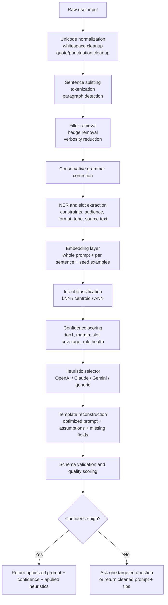

# Layered Open Source AnalyzePrompt Pipeline Without LLMs

## Executive summary

Yes—this can be done without an LLM, and it can be fast enough for a consumer product if you keep the job narrow: normalize the user’s raw text, remove filler, correct obvious grammar, extract key entities and constraints, embed the cleaned text, classify intent by nearest neighbors, apply target-model heuristics from official docs, and reconstruct a prompt from templates. The critical design choice is to treat this as **deterministic prompt optimization**, not as creative rewriting. In that frame, every primitive you need already exists in local or self-hostable open-source tooling for JavaScript and Python: browser and Node inference via urlTransformers.jsturn0search1 and urlONNX Runtimeturn4search17, linguistic preprocessing with urlwink-nlpturn1search0 / urlretextturn12search1 / urlcompromiseturn1search1, grammar correction through self-hosted urlLanguageToolturn1search6, semantic search and similarity via urlSentence Transformersturn0search8, ANN indexing via urlUSearchturn2search0 or urlhnswlib-nodeturn2search1, schema validation via urlAjvturn3search3, and telemetry via urlOpenTelemetry JSturn1search3. citeturn18view0turn18view2turn23view1turn28view0turn20view0turn25view0turn25view1turn23view11turn25view4

The strongest practical recommendation is a **two-tier design**. For maximum privacy and low latency, run a compact embedding model locally in the browser or Electron shell with urlTransformers.jsturn0search1 on top of urlONNX Runtime Webturn4search4, using a small English model such as urlall-MiniLM-L6-v2turn9search3 or urlbge-small-en-v1.5turn8search5. For heavier traffic, long inputs, or multi-user batching, move only the embedding service to a server-side microservice using urlonnxruntime-nodeturn4search17 or urlText Embeddings Inferenceturn4search3. ONNX Runtime’s own web docs explicitly note the privacy, offline, and latency advantages of in-browser inference, while TEI adds dynamic batching, fast startup, ONNX and safetensors loading, and OpenTelemetry support for production serving. citeturn18view2turn18view3turn19view1turn19view2

The limitation is equally clear. A no-LLM stack can improve **clarity, structure, completeness, and model compatibility**; it cannot truly “invent” missing facts, perform broad paraphrase with human nuance, or deeply reinterpret ambiguous requests. That means the best fallback is not another rewrite attempt; it is one targeted question, or a cleaned prompt plus a short note about what is missing. This is the right trade: predictable behavior, privacy, and speed over maximal linguistic cleverness. citeturn20view0turn20view3turn28view0turn13search0turn16search0turn13search7

## Recommended architecture

For a regular-user product, the winning pattern is a **layered pipeline with deterministic transforms up front and semantic routing in the middle**. The order matters. If you embed first and clean later, your seed-example matching is noisier. If you classify intent before asking whether the text is malformed, the taxonomy becomes unstable. The right sequence is: normalize text, split paragraphs and sentences, strip filler and obvious verbosity, correct grammar conservatively, extract entities and slots, create both sentence-level and whole-prompt embeddings, classify by prototype similarity, score confidence, select provider-specific prompt heuristics, reconstruct from templates, validate output schema, and finally decide whether to output an optimized prompt or one targeted question. The feasibility of this exact stack is supported by the official capabilities of the browser and Node runtimes, the NLP libraries, and the embedding/search tooling cited below. citeturn18view0turn18view2turn23view1turn23view5turn23view6turn28view0turn20view3turn25view1turn23view10turn23view11



A second design choice matters: **use extractive condensation, not abstractive summarization**. Sentence-transformer models give you vectors, not natural-language generation. So condensation should be implemented as sentence ranking plus slot preservation, not “summarize like a human.” In practice that means: keep direct constraints, drop apologies and filler, deduplicate repeated asks, preserve entity-bearing sentences, and use embedding relevance plus diversity scoring to pick what survives. This is much more stable than trying to emulate a summarizer with rules alone, and it keeps the pipeline honest about what it can and cannot do. citeturn20view0turn20view3turn23view1turn23view6turn23view7

## Tool stack by pipeline stage

The table below prioritizes JavaScript, Node, and browser-capable components. Where there is a materially better server-side alternative, it is noted.

| Stage | Primary recommendation | Why this is the best fit | Server-side or Python alternative |
|---|---|---|---|
| Normalization | urlwink-nlp-utilsturn1search16 + a small custom rule layer | It already exposes preprocessing utilities for strings, names, paragraphs, sentences, and tokens, and is designed specifically as NLP preprocessing for ML tasks. citeturn23view8turn34view4 | Same rule layer on the server; no heavyweight NLP dependency needed |
| Sentence splitting | urlwink-nlpturn1search0 for the main path; urlsbdturn12search2 for a tiny rule-based fallback; urlsentence-splitterturn3search1 when quoted text structure matters | wink’s browser model includes SBD and NER in one package; SBD is tiny and rule-based; sentence-splitter is stronger for quote/context boundaries. citeturn23view1turn23view6turn23view7turn35view0turn35view1 | Server still uses the same libraries cleanly |
| Filler removal and style linting | urlwrite-goodturn12search3 + custom hedge and discourse-marker rules | write-good already detects passive voice, “so” at sentence starts, weasel words, adverbs, and wordiness; you should supplement it with your own consumer-prompt rules. citeturn28view1 | Same approach server-side |
| Grammar correction | urlLanguageToolturn1search6 as a self-hosted HTTP service | It is open source, supports 25+ languages, and the official repo points to running your own server and HTTP API docs. citeturn28view0 | Same service; easiest from Node or Python over HTTP |
| NER and lightweight slot extraction | urlwink-nlp with wink-eng-lite-web-modelturn1search8 first; urlcompromiseturn1search1 when you want easy pattern transforms; urlNLP.jsturn12search0 if you also want classic intent/NER utilities | wink’s web model is especially attractive for client-side use because the gzipped model is about 1 MB and includes tokenization, SBD, NER, sentiment, stemming, lemmatization, and readability. compromise is easy to extend; NLP.js includes built-in entity extraction. citeturn23view1turn31view0turn23view4turn34view0turn34view1turn34view2 | Keep wink or move to heavier stacks later only if necessary |
| Embeddings | urlTransformers.jsturn0search1 + urlONNX Runtime Webturn4search4 for browser or Electron | Official docs confirm browser execution, WASM by default, optional WebGPU, and ONNX Runtime underneath. citeturn18view0turn18view2 | urlSentence Transformersturn0search8, urlonnxruntime-nodeturn4search17, urlFastEmbedturn5search1, or urlText Embeddings Inferenceturn4search3 for higher throughput. citeturn20view0turn18view3turn30view1turn19view1turn19view2 |
| Nearest-neighbor search | Linear cosine scan for small seed sets, then urlhnswlib-nodeturn2search1 or urlUSearchturn2search0 when seed/template stores grow | For a seed bank under a few thousand examples, exact cosine is simpler; sentence-transformers’ own semantic search utility is fine up to roughly one million entries, but ANN makes sense once you start accumulating many templates or examples. citeturn20view3turn25view1turn25view0turn35view2turn35view3 | urlQdrantturn4search2 when you want a proper vector service with filtering and a JS SDK. citeturn25view2turn25view3 |
| Template engine | urlHandlebarsturn3search2 | It is Mustache-compatible, compiles templates into JS functions, and is MIT licensed. It is more than enough for prompt reconstruction. citeturn23view10 | Same |
| Output validation | urlAjvturn3search3 | It runs in Node and the browser, and supports modern JSON Schema drafts. That makes it ideal for validating the output contract of `optimizedPrompt`, `confidence`, `missingQuestion`, and `appliedHeuristics`. citeturn23view11turn35view4 | Same |
| Quality scoring | urlretext-readabilityturn2search3 + LanguageTool error counts + embedding-margin confidence | readability alone is not enough, but it is a useful part of a composite score. The official plugin exposes standard readability formulas. citeturn23view9 | Same |
| Telemetry | urlOpenTelemetry JSturn1search3 | Official docs support Node and browser metrics, traces, and logs; TEI also exports OpenTelemetry. citeturn25view4turn25view5turn19view1turn19view2 | Same |

The practical implication is that you do **not** need one giant NLP framework. The best stack is a layered one: a few tiny text utilities, one grammar service, one embedding model, one ANN index, one template engine, and strong guardrails around confidence and missing fields. That is exactly the architecture most likely to stay understandable, debuggable, and browser-portable. citeturn23view1turn28view0turn18view0turn25view1turn23view10turn23view11

## Embedding models and runtime choices

For this product, model choice should follow the input pattern. Most prompt-optimization inputs are short to medium English text. That means the best defaults are **compact 384-dimensional English encoders**. The two safest browser-first defaults are urlall-MiniLM-L6-v2turn9search3 and urlbge-small-en-v1.5turn8search5. Move up to urljina-embeddings-v2-small-enturn8search3 or urlgte-base-en-v1.5turn8search2 only when you truly need very long inputs. Use urle5-small-v2turn7search1 if your classification and retrieval logic is comfortable with its required `query:` / `passage:` prefixes. citeturn10view0turn21view0turn29view0turn10view3turn8search2turn29view1

### Candidate model comparison

| Model | Speed | Accuracy profile | Size | License | Browser support | Ease of integration | Best use |
|---|---|---|---|---|---|---|---|
| urlall-MiniLM-L6-v2turn9search3 | Very fast | Strong baseline for short English semantic matching | 384 dims; safetensors about 90.9 MB; ONNX and OpenVINO exports present | Apache-2.0 | Strong, especially through ONNX and JS runtimes | Very easy | Best “just works” local default for short prompts. citeturn10view0turn20view1 |
| urlbge-small-en-v1.5turn8search5 | Fast | Typically a stronger retrieval-tilted small model than MiniLM; v1.5 improves instruction-free retrieval and similarity distribution | 33.4M params; about 133 MB; 384 dims; max 512 tokens | MIT | Strong through ONNX/TEI; practical in JS and browser contexts | Easy | Best overall English small model for seed-template matching. citeturn21view0turn22view0turn36view0turn30view0 |
| urle5-small-v2turn7search1 | Fast | Good when you honor the training prefixes; weaker if you ignore them | 384 dims; ONNX and safetensors about 133 MB; max 512 tokens | MIT | Strong, because ONNX is already published | Easy, but only if you enforce prefixes | Best for asymmetric retrieval or well-structured prototype stores. citeturn29view0turn10view2 |
| urljina-embeddings-v2-small-enturn8search3 | Medium | Attractive when long input support matters more than minimum latency | 8192-token support; safetensors about 65.4 MB, ONNX about 130 MB | Apache-2.0 | Possible, though heavier and includes custom code in Python paths | Medium | Best browser/server fallback for long user prompts or pasted documents. citeturn8search3turn10view3 |
| urlgte-base-en-v1.5turn8search2 | Slower | Better suited to server mode and longer inputs | 8192-token support; model.safetensors about 547 MB; Transformers.js and TEI support noted in official pages | Apache-2.0 | Possible, but not browser-first in practice because of size | Medium | Best server-side long-context option before larger instruction-tuned embedders. citeturn8search2turn8search6turn29view1turn19view2 |

### Runtime and serving comparison

| Runtime | Speed | Privacy | Size and ops footprint | License | Browser support | Ease of integration | Best use |
|---|---|---|---|---|---|---|---|
| urlTransformers.jsturn0search1 | Fast for small models; can use WebGPU | Excellent | Low app complexity, model downloaded to client | Apache-2.0 via HF ecosystem | Yes | High | Best for browser-local and Electron deployments. citeturn18view0 |
| urlonnxruntime-webturn4search4 / urlonnxruntime-nodeturn4search17 | High | Excellent local privacy | Lightweight runtime, but you manage model exports and pooling | MIT-style project docs do not foreground a single runtime license here; use official package terms in your implementation review | Web and Node | Medium | Best when you want full runtime control and manual optimization. citeturn18view2turn18view3 |
| urlSentence Transformersturn0search8 | High server-side | Excellent local privacy | Python + PyTorch footprint | Apache-2.0 | No | High in Python, low in browser use cases | Best reference implementation and Python benchmarking harness. citeturn20view0turn20view1 |
| urlFastEmbedturn5search1 | High on CPU | Excellent local privacy | Small Python stack via ONNX Runtime and quantized models | Apache-2.0 in the Qdrant ecosystem | No | High | Best low-friction Python CPU microservice. citeturn30view1 |
| urlText Embeddings Inferenceturn4search3 | Highest throughput | Good, if self-hosted | Heavier, but production-grade with batching, tracing, Prometheus | Apache-2.0 | No | Medium | Best embedding gateway for multi-user server deployments. citeturn19view1turn19view2 |
| urlHugging Face feature-extraction APIturn0search5 | Fastest to start | Weakest privacy | Near-zero local ops, but hosted | Service, not a local OSS runtime | Yes over API | Very high | Best temporary fallback, not the default for privacy-first product design. citeturn19view0 |

My recommendation is straightforward. If you want one default: **browser or Electron** → `bge-small-en-v1.5`; **server Node** → `bge-small-en-v1.5` or `all-MiniLM-L6-v2`; **long-input server mode** → `gte-base-en-v1.5`; **retrieval-specific prototype matching with discipline around prefixes** → `e5-small-v2`. citeturn21view0turn22view0turn29view0turn8search2turn10view0

## Wiring patterns, caching, batching, and confidence scoring

The cleanest implementation is to treat prompt optimization as a single typed transform that returns structured data, not just text. In practice, the pipeline should return something like:

```ts
type AnalyzePromptResult = {
  detectedIntent: "decide" | "write" | "learn" | "plan" | "research" | "create" | "fix" | "extract" | "organize" | "act";
  confidence: number;
  cleanedPrompt: string;
  optimizedPrompt: string;
  missingQuestion?: string;
  missingSlots: string[];
  appliedHeuristics: string[];
  providerProfile: "openai" | "claude" | "gemini" | "generic";
};
```

The runtime pattern below keeps one embedding model warm, memoizes text-to-vector results, batches sentence embeddings, and uses a centroid-plus-margin classifier. The API surface is intentionally small because deterministic systems become fragile when each stage invents its own metadata.

```js
import { pipeline } from '@huggingface/transformers';
import Handlebars from 'handlebars';
import Ajv from 'ajv';

const MODEL_ID = 'BAAI/bge-small-en-v1.5';
const EMBED_CACHE = new Map();
let embedderPromise;

function getEmbedder() {
  if (!embedderPromise) {
    embedderPromise = pipeline('feature-extraction', MODEL_ID, {
      device: 'webgpu',      // fall back to WASM/CPU if unavailable
      quantized: true
    });
  }
  return embedderPromise;
}

async function embedTexts(texts) {
  const embedder = await getEmbedder();
  const missing = texts.filter(t => !EMBED_CACHE.has(t));
  if (missing.length) {
    const vectors = await embedder(missing, {
      pooling: 'mean',
      normalize: true
    });
    missing.forEach((t, i) => EMBED_CACHE.set(t, Array.from(vectors[i].data ?? vectors[i])));
  }
  return texts.map(t => EMBED_CACHE.get(t));
}

function cosine(a, b) {
  let dot = 0, na = 0, nb = 0;
  for (let i = 0; i < a.length; i++) {
    dot += a[i] * b[i];
    na += a[i] * a[i];
    nb += b[i] * b[i];
  }
  return dot / (Math.sqrt(na) * Math.sqrt(nb) || 1);
}

function classifyIntent(queryVec, centroids) {
  const scored = Object.entries(centroids)
    .map(([intent, vec]) => ({ intent, score: cosine(queryVec, vec) }))
    .sort((a, b) => b.score - a.score);

  const top1 = scored[0];
  const top2 = scored[1] ?? { score: 0 };

  return {
    intent: top1.intent,
    top1: top1.score,
    margin: top1.score - top2.score,
    ranked: scored
  };
}

function scoreConfidence({ top1, margin, slotCoverage, lintPenalty, ambiguityPenalty }) {
  const raw =
    0.45 * top1 +
    0.25 * Math.max(0, margin) +
    0.20 * slotCoverage +
    0.10 * (1 - lintPenalty) -
    ambiguityPenalty;

  return Math.max(0, Math.min(1, raw));
}
```

When your example bank is small, use **exact cosine on normalized embeddings**. The official Sentence Transformers docs note that dot product on normalized embeddings is equivalent to cosine and faster than repeatedly re-normalizing for cosine, and their `semantic_search()` utility is already appropriate for corpora up to roughly one million entries. In JS, the same logic applies: normalize once, then use dot products. Only switch to ANN when your live seed or template bank becomes large enough to justify the added complexity. citeturn20view2turn20view3

For condensation, use sentence ranking instead of rule-only trimming. Score each sentence against the whole cleaned prompt or an intent centroid, prefer sentences that contain extracted slots or named entities, and suppress near-duplicates with a Maximal Marginal Relevance style penalty. This preserves the user’s real ask while deleting repetition. For prompt reconstruction, keep one template per intent, then splice in provider-specific sections and only the slots you actually found. citeturn23view1turn23view7turn20view3

```js
function selectSentences(sentences, sentenceVecs, queryVec, lockedIds = new Set(), k = 4, lambda = 0.78) {
  const selected = [];

  while (selected.length < k && selected.length < sentences.length) {
    let best = null;

    for (let i = 0; i < sentences.length; i++) {
      if (selected.includes(i)) continue;

      const relevance = cosine(sentenceVecs[i], queryVec);
      const redundancy = selected.length
        ? Math.max(...selected.map(j => cosine(sentenceVecs[i], sentenceVecs[j])))
        : 0;

      const lockedBoost = lockedIds.has(i) ? 0.15 : 0;
      const mmr = lambda * relevance - (1 - lambda) * redundancy + lockedBoost;

      if (!best || mmr > best.mmr) best = { i, mmr };
    }

    selected.push(best.i);
  }

  return selected.sort((a, b) => a - b).map(i => sentences[i]).join(' ');
}

const templates = {
  decide: Handlebars.compile(`
Goal: decide between options.
Task: compare the options and recommend one.
Options:
{{#each options}}- {{this}}
{{/each}}

Decision criteria:
{{#each criteria}}- {{this}}
{{/each}}

Output format:
- short recommendation
- comparison table
- tradeoffs
- final choice with reason
`),
  write: Handlebars.compile(`
Task: write {{format}} for {{audience}}.
Goal: {{goal}}
Tone: {{tone}}
Length: {{length}}
Must include:
{{#each mustInclude}}- {{this}}
{{/each}}
`),
  extract: Handlebars.compile(`
Task: extract structured information from the source text below.
Fields:
{{#each fields}}- {{this}}
{{/each}}

Return schema:
{{schemaName}}
Source text:
{{source}}
`)
};
```

Output validation should sit at the very end, not the beginning. Use a JSON Schema validated by urlAjvturn3search3 so the UI layer always gets the same contract. This also gives you a reliable place to attach telemetry and A/B test signals. citeturn23view11turn35view4turn25view4

## Intent taxonomy, template mapping, and provider heuristics

The right taxonomy for ordinary users is the one you proposed: **decide, write, learn, plan, research, create, fix, extract, organize, act**. It is small enough for stable nearest-neighbor routing and broad enough to cover most consumer prompting behavior. The classifier should not try to infer “the perfect downstream task.” It should infer the **interaction shape** the user is asking for. That makes template selection stable even when the subject matter changes from travel to parenting to code to school. The example bank for each intent should contain 30–100 seed utterances written in everyday language, not power-user jargon. citeturn32view1turn32view0turn32view2turn32view3turn33view1

Below is an illustrative seed store. The vectors are **toy 4D projections for explanation**; in production they are the full model outputs, usually 384 dimensions for compact models.

```ts
const seedExamples = [
  {
    intent: 'decide',
    text: 'Help me choose between two apartments near my work.',
    vec4: [0.81, -0.12, 0.33, 0.09],
    template: 'decision.compare.v1'
  },
  {
    intent: 'write',
    text: 'Write a polite email asking for a deadline extension.',
    vec4: [0.12, 0.84, -0.08, 0.17],
    template: 'writing.email.v1'
  },
  {
    intent: 'learn',
    text: 'Explain compound interest like I am a beginner.',
    vec4: [0.29, 0.14, 0.77, -0.04],
    template: 'learning.explain.v1'
  },
  {
    intent: 'plan',
    text: 'Plan a three-day family trip with a tight budget.',
    vec4: [0.55, 0.18, 0.41, 0.32],
    template: 'planning.itinerary.v1'
  },
  {
    intent: 'research',
    text: 'Research the pros and cons of homeschooling in Texas.',
    vec4: [0.47, -0.02, 0.64, 0.21],
    template: 'research.brief.v1'
  },
  {
    intent: 'create',
    text: 'Create ten YouTube title ideas for a fitness channel.',
    vec4: [-0.11, 0.72, 0.38, 0.44],
    template: 'creation.idea-list.v1'
  },
  {
    intent: 'fix',
    text: 'My resume sounds weak. Help me fix it.',
    vec4: [0.08, 0.46, -0.16, 0.79],
    template: 'fix.revise.v1'
  },
  {
    intent: 'extract',
    text: 'Pull the names, dates, and action items from these notes.',
    vec4: [0.36, 0.09, -0.04, 0.88],
    template: 'extract.schema.v1'
  },
  {
    intent: 'organize',
    text: 'Organize these scattered ideas into a clean outline.',
    vec4: [0.44, 0.21, 0.18, 0.69],
    template: 'organize.outline.v1'
  },
  {
    intent: 'act',
    text: 'Give me the exact steps to file this small-claims case.',
    vec4: [0.62, 0.05, 0.11, 0.58],
    template: 'action.steps.v1'
  }
];
```

A slot schema should sit alongside every intent. For example, `write` wants audience, format, tone, and length; `decide` wants options and criteria; `extract` wants source text and explicit fields; `fix` wants original artifact plus desired outcome; `plan` wants time, budget, location, and constraints. Low-confidence behavior should always ask only for the highest-value missing slot. That keeps the product feeling fast rather than interrogative.

### Intent-to-template mapping

| Intent | Required slots | Default template behavior | One targeted missing-input question |
|---|---|---|---|
| decide | `options`, `criteria` | comparative structure, recommendation, tradeoffs | “What are the options, and what matters most in the choice?” |
| write | `audience`, `format`, `goal` | scaffold output by audience, tone, and length | “Who is this for, and what format do you want?” |
| learn | `topic`, `level` | explain, define, then example | “What do you already know about the topic?” |
| plan | `goal`, `time`, `constraints` | steps, sequence, milestones | “What is the goal, and what time or budget constraint matters most?” |
| research | `question`, `scope`, `timeframe` | brief, sources, opposing views | “What exact question do you want answered, and how broad should the scope be?” |
| create | `artifact`, `style`, `constraints` | brainstorm then filter | “What are you creating, and what style or constraints should it follow?” |
| fix | `artifact`, `problem`, `desired_state` | diagnose, patch, verify | “What is broken now, and what should the fixed result look like?” |
| extract | `source`, `fields` | schema-first extraction | “What fields do you want extracted from the source text?” |
| organize | `items`, `grouping_rule` | categorize, deduplicate, order | “What should the organizing principle be—priority, theme, timeline, or something else?” |
| act | `task`, `context`, `risk_level` | exact steps, prerequisites, warnings | “What action do you need to take, and in what context?” |

### Provider heuristics

The provider-specific rules should be kept in data, not in code branches. The official documentation from urlOpenAI prompt engineering docsturn13search0, urlAnthropic prompt engineering docsturn13search1, and urlGemini prompt design docsturn13search7 is consistent on one point: clear instructions, examples, structure, and explicit output requirements improve reliability. The differences are in formatting preferences and runtime features. citeturn15view2turn14view1turn16search1turn14view3turn14view4turn14view5

| Target | Apply automatically | Suggest to the user only | Why |
|---|---|---|---|
| urlOpenAI and ChatGPT API docsturn13search0 | Put stable instructions and examples first; split prompt into identity, instructions, examples, and context blocks; use Structured Outputs instead of bare JSON mode when you own the response schema; move variable user content to the end for prompt caching. citeturn15view2turn14view1turn19view3 | Few-shot examples only when intent confidence is medium or when the output shape is brittle | OpenAI’s docs explicitly show structured prompt sections, recommend Structured Outputs over JSON mode, and note exact-prefix prompt caching benefits for static prefixes. citeturn15view2turn14view1turn19view3 |
| urlClaude API docsturn13search1 | Wrap instructions, context, examples, and input in XML tags; specify output format explicitly; keep a stable cached prefix and place the breakpoint at the last static block if you use prompt caching. citeturn16search1turn16search21turn14view3 | Prompt chaining or role prompting for very complex tasks only | Anthropic explicitly recommends XML structuring, explicit formats, and exact-prefix caching behavior with breakpoint placement guidance. citeturn16search1turn14view3turn16search21 |
| urlGemini API docsturn13search7 | Use clear and specific instructions; emit JSON Schema when you need typed responses; pass schemas through Zod on the JS side. citeturn14view4turn14view5 | Examples only when your taxonomy mapping is ambiguous | Google’s official docs emphasize clear task wording and JSON Schema-based structured outputs, with direct JS schema support. citeturn14view4turn14view5 |
| Generic local instruct models | Keep prompts short, explicit, and flat; minimize nested meta-instructions; demand one output format only | Rich examples and long “roleplay” instructions | This is an engineering recommendation, not a provider quote: smaller local instruct models usually degrade first on long, nested prompt scaffolds |

In other words, the pipeline should silently do the following. For OpenAI-compatible targets, prefer sectioned Markdown/XML blocks and schema-first outputs. For Claude, serialize into XML-tagged sections and preserve a static prefix for caching. For Gemini, keep the instruction plain and the schema explicit. Those are not folklore tips; they are drawn directly from the official provider docs. citeturn15view2turn14view1turn19view3turn16search1turn14view3turn14view4turn14view5

## Evaluation, benchmarks, fallback behavior, and seed datasets

You should evaluate this system as a **classification-and-reconstruction product**, not as a generic NLP demo. The primary metrics are: top-1 intent accuracy, top-2 recall, confidence calibration, slot extraction precision and recall, targeted-question usefulness, latency by stage, and downstream human preference for the optimized prompt over the raw one. For the embedding and intent layer, you only need a few hundred carefully labeled user prompts to produce an honest benchmark. For the UX layer, you need side-by-side human evals asking: “Did the optimized prompt better preserve the user’s ask, add the right structure, and avoid over-assuming?” citeturn32view1turn32view0turn32view2turn32view3turn33view1

A lightweight benchmark plan should look like this. Build a hand-labeled set of roughly 500–1,000 prompts across the ten intents, with balanced ambiguity levels and a mix of short and long inputs. Seed the set with public intent corpora such as urlBANKING77turn26search0, urlCLINC150turn26search17, and urlAmazon MASSIVEturn26search2 for intent-shape examples, then add prompt corpora such as urlDatabricks Dolly 15kturn26search3 and urlOpenAssistant OASST1turn27search2 for real instruction style and conversational prompt phrasing. BANKING77 gives fine-grained single-domain intent classification, CLINC150 is useful for OOD behavior, MASSIVE adds multilingual and multi-intent structure, Dolly contributes instruction categories, and OASST1 contributes human-generated and human-annotated multi-turn prompt trees. citeturn32view1turn32view0turn32view2turn32view3turn33view1

Your performance targets should be engineering targets, not promises from the libraries: warm p50 under 400 ms end to end for short prompts on desktop browser or Node, cold-start under about 1.5 s for browser-local small models, intent classification above 90% top-2 recall on your own ten-intent taxonomy, and targeted-question trigger rates below 15% on common user prompts. These are recommended thresholds, not published benchmarks. The main failure modes to watch are predictable: multi-intent prompts that really need splitting, pruning that deletes meaning-bearing hedges, grammar correction that changes tone, retrieval models that mis-handle long pasted documents, and provider heuristics that over-constrain the output. 

Fallback behavior should be deterministic and tied to confidence:

| Confidence state | Behavior |
|---|---|
| High confidence, high slot coverage | Return optimized prompt, detected intent, confidence, and applied heuristics |
| Medium confidence, one key missing slot | Ask exactly one targeted question, then hold the cleaned prompt ready |
| High intent confidence but low slot coverage | Return cleaned prompt plus “best current version” and surface the missing question inline |
| Low top-1 score or low margin | Do not over-rewrite; return cleaned prompt and 2–3 model-specific tips |
| Very long input beyond small-model comfort | Route to long-context embedder or truncate by sentence ranking before classification |

A small but valuable UX detail: even when confidence is high, expose a human-readable explanation such as “Detected intent: write. Missing nothing. Applied: format, audience, tone, structured output.” That makes the system easier to trust and debug, and it gives you telemetry hooks for error analysis.

### Sample consumer test cases

| Raw user input | Expected intent | Expected missing question |
|---|---|---|
| “help me ask my landlord if i can pay 3 days late without sounding irresponsible” | write | none or “email or text?” |
| “i want to know if homeschooling is a bad idea in texas for a kid with adhd” | research | “Do you want legal requirements, academic outcomes, or both?” |
| “plan a cheap 2 day trip for me and my wife near chicago with food and quiet places” | plan | none |
| “these notes are chaos can you pull the action items and deadlines” | extract | “Paste the notes or upload the text” |
| “which is smarter for us right now, buying a used minivan or keeping the sedan for 2 more years” | decide | “What matters most: monthly cost, reliability, or space?” |
| “my resume sounds weak and generic” | fix | “Paste the current resume summary or bullet you want fixed” |

## Open questions and limitations

The unresolved issue is not feasibility. It is **scope discipline**. If you keep the product promise to: “we will understand the shape of your request, clean it up, ask for the one missing thing, and format it for the target model,” then a no-LLM stack is viable. If you promise: “we will deeply reinterpret and elevate any vague human thought into an excellent prompt,” then you are back in LLM territory.

There are also a few implementation decisions you should test rather than assume. First, whether `bge-small-en-v1.5` or `all-MiniLM-L6-v2` yields better intent separation on your own user prompts. Second, whether local browser inference is consistently good enough on older devices, or whether you need a server-side embedding fallback. Third, whether conservative grammar correction helps more than it harms for ordinary users who may rely on tone-laden wording. Fourth, whether a tenth “mixed” intent is worth adding, or whether it is better to force the system to ask one disambiguation question.

The most important product constraint is this: do not let the pipeline fabricate. When uncertainty is real, the right answer is either one short question or a cleaned prompt with transparent assumptions. That is the discipline that makes a no-LLM analyzer trustworthy.